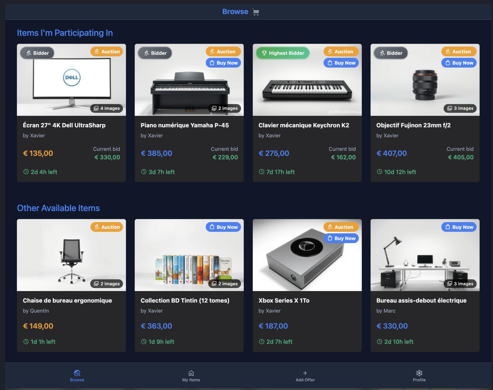
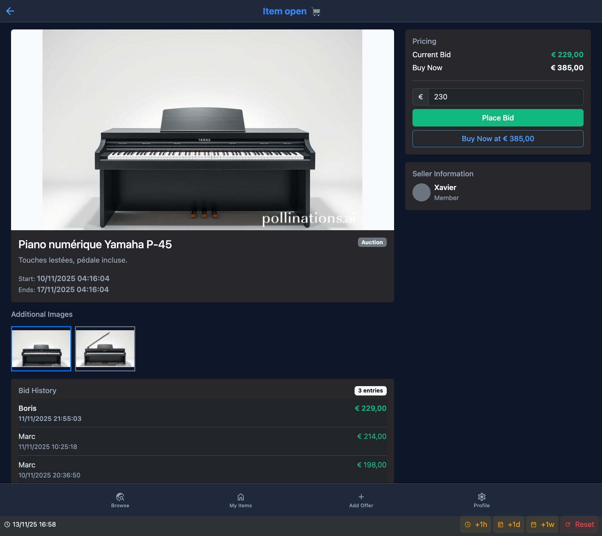
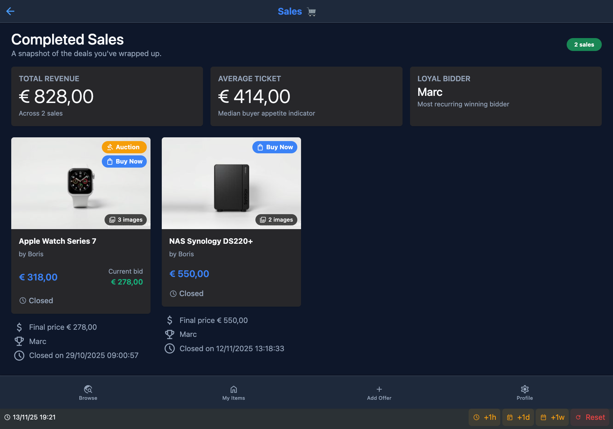

# EPayFC — Auction site AJAX/PHP

Plateforme web d’**enchères et de vente** développée dans le cadre du cours **PRWB** (Programmation Web) à l’EPFC.

Les utilisateurs publient des offres, enchérissent, achètent immédiatement, gèrent leurs articles et consultent leurs ventes / achats.  
Une partie de l’interface est dynamique via **AJAX** (`fetch`) : recherche/filtres, gestion d’images, catégories, validations.

## Aperçu







---

## Équipe

| Membre |
|--------|
| Zié Traoré |
| Hugo Castelain |
| Sam Prophete Nsengimana |

Groupe **C04** — année académique **2025–2026**.

---

## Stack technique

| Couche | Technologie |
|--------|-------------|
| Backend | **PHP** (MVC custom : `framework/` + `controller/` + `model/` + `view/`) |
| Frontend | HTML / CSS / **JavaScript** + **AJAX** (`fetch`) |
| UI | Bootstrap 5 (CDN) |
| Base de données | **MySQL / MariaDB** |
| Serveur | Apache (`.htaccess`, typiquement XAMPP) |

---

## Fonctionnalités

### Visiteur / utilisateur
- Inscription, connexion, profil (photo, IBAN, mot de passe)
- Parcourir les offres (recherche / filtres AJAX)
- Consulter une offre (images, historique d’enchères, vendeur)
- Enchérir ou acheter immédiatement (`buy now`)
- Vente directe (sans enchère de départ)
- Gérer ses articles (création, édition, suppression, images)
- Consulter ses achats et ses ventes

### Admin
- Gestion des catégories (ordre, CRUD, interactions AJAX)

### Technique
- Date/heure système simulée pour les scénarios de test
- Uploads d’images (articles + profil)
- Règles métier côté PHP + validations JS

---

## Structure du dépôt

```
prwb_2526_c04/
├── index.php              # Point d’entrée
├── framework/             # Router, Controller, Model, View, Tools
├── controller/            # Contrôleurs métier
├── model/                 # Entités (User, Item, Bid, Category…)
├── view/                  # Vues PHP + partials
├── js/                    # Scripts AJAX / validation
├── css/                   # Styles
├── database/              # Scripts SQL
├── docs/
│   └── screenshots/       # Captures d’écran
├── config/                # Configuration locale (dev.ini)
├── uploads/               # Images uploadées (non versionnées)
└── utils/                 # Helpers (temps simulé, images, format)
```

---

## Architecture

L’application suit un **MVC maison** :

1. **`index.php`** — point d’entrée, délègue au `Router`
2. **Controller** — actions métier (browse, offre, enchère, profil, ventes, admin…)
3. **Model** — entités `User`, `Item`, `Bid`, `Category`, `ItemPicture`
4. **View** — pages PHP + partials (layout commun, navbar, fiche article)

Le JavaScript n’est pas un front séparé : il enrichit les pages déjà rendues côté serveur. Les appels **AJAX** (`fetch`) servent surtout à la recherche/filtres, à la gestion d’images, aux catégories et aux validations, sans recharger toute la page.

Côté métier, une offre peut être une **enchère**, un **achat immédiat**, ou une **vente directe**. Une **date/heure simulée** permet de tester les fins d’enchère et les scénarios de cours sans dépendre de l’horloge réelle.

---

## Déploiement

Le site a été mis en production sur l’infrastructure **Infolab** de l’EPFC : un **VPS** étudiant (Apache, PHP, MySQL), exposé publiquement pendant l’année du cours, par exemple :

```text
http://infolab.epfc.eu:58327
```

Cette instance n’est plus accessible (VPS de l’année précédente éteint ou réattribué). Le dépôt GitHub reste la référence du projet.
