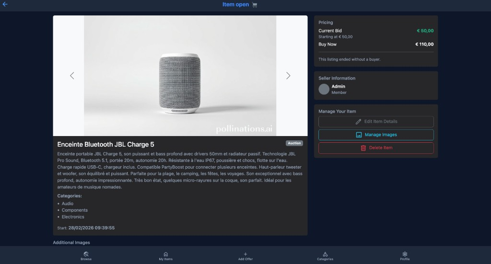

# EPayFC — Auction site AJAX/PHP

Plateforme web d’**enchères et de vente** développée dans le cadre du cours **PRWB** (Programmation Web) à l’EPFC.

Les utilisateurs publient des offres, enchérissent, achètent immédiatement, gèrent leurs articles et consultent leurs ventes / achats.  
Une partie de l’interface est dynamique via **AJAX** (`fetch`) : recherche/filtres, gestion d’images, catégories, validations.

## Aperçu




---

## Équipe

| Membre |
|--------|
| Zié Traoré |
| Hugo Castelain |
| Sam Prophete Nsengimana |

Groupe **C04** — année académique **2025–2026**.

---

## Stack technique

| Couche | Technologie |
|--------|-------------|
| Backend | **PHP** (MVC custom : `framework/` + `controller/` + `model/` + `view/`) |
| Frontend | HTML / CSS / **JavaScript** + **AJAX** (`fetch`) |
| UI | Bootstrap 5 (CDN) |
| Base de données | **MySQL / MariaDB** |
| Serveur | Apache (`.htaccess`, typiquement XAMPP) |

---

## Fonctionnalités

### Visiteur / utilisateur
- Inscription, connexion, profil (photo, IBAN, mot de passe)
- Parcourir les offres (recherche / filtres AJAX)
- Consulter une offre (images, historique d’enchères, vendeur)
- Enchérir ou acheter immédiatement (`buy now`)
- Vente directe (sans enchère de départ)
- Gérer ses articles (création, édition, suppression, images)
- Consulter ses achats et ses ventes

### Admin
- Gestion des catégories (ordre, CRUD, interactions AJAX)

### Technique
- Date/heure système simulée pour les scénarios de test
- Uploads d’images (articles + profil)
- Règles métier côté PHP + validations JS

---

## Structure du dépôt

```
prwb_2526_c04/
├── index.php              # Point d’entrée
├── framework/             # Router, Controller, Model, View, Tools
├── controller/            # Contrôleurs métier
├── model/                 # Entités (User, Item, Bid, Category…)
├── view/                  # Vues PHP + partials
├── js/                    # Scripts AJAX / validation
├── css/                   # Styles
├── database/              # Scripts SQL
├── docs/
│   └── screenshots/       # Captures d’écran
├── config/                # Configuration locale (dev.ini)
├── uploads/               # Images uploadées (non versionnées)
└── utils/                 # Helpers (temps simulé, images, format)
```

---

## Prérequis

- **PHP 8+** (selon l’environnement du cours)
- **MySQL / MariaDB**
- **Apache** avec `mod_rewrite` (XAMPP recommandé)
- Droits d’écriture sur `uploads/` (et éventuellement `database/` en dev)

---

## Installation

### 1. Cloner et placer sous le DocumentRoot

Exemple XAMPP / macOS :

```bash
# le dossier doit être accessible via le web_root configuré
```

### 2. Base de données

Importez le script SQL :

```bash
mysql -u root -p < database/prwb_2526_c04.sql
```

(Adaptez avec `prwb_2526_c04_dump.sql` si vous voulez des données de démo.)

### 3. Configuration

Éditez `config/dev.ini` :

```ini
[DB]
dbtype = mysql
dbhost = 127.0.0.1
dbname = prwb_2526_c04
dbuser = root
dbpassword = VOTRE_MOT_DE_PASSE
mysql_path = "/Applications/XAMPP/xamppfiles/bin/"

[Controllers]
default_controller = browser

[Web]
web_root = "/prwb_2526_c04/"
```

Ajustez `web_root` selon l’URL locale (ex. `http://localhost/prwb_2526_c04/`).

### 4. Permissions (dev)

```bash
chmod -R 777 uploads
```

### 5. Lancer

Démarrez Apache + MySQL (XAMPP), puis ouvrez l’URL correspondant à `web_root`.

---

## Déploiement (serveur école)

Le projet a été **déployé en production** sur l’infrastructure de l’EPFC (**Infolab**) :

1. Création d’un **VPS** étudiant sur le serveur de l’école  
2. Configuration du serveur web (Apache) + PHP + base MySQL  
3. Déploiement de l’application pour la rendre **accessible publiquement** via Internet  

Exemple d’URL utilisée pendant l’année du cours :

```text
http://infolab.epfc.eu:58327
```

Cette instance **n’est plus accessible** aujourd’hui (environnement de l’année précédente / VPS éteint ou réattribué).  
Le dépôt GitHub sert désormais de référence pour le code et l’installation en local.

---

## Comptes de démonstration

Mot de passe commun (données de cours) : `Password1,`

| Email | Rôle typique |
|-------|----------------|
| `boverhaegen@epfc.eu` | utilisateur |
| `mamichel@epfc.eu` | utilisateur |
| `quhouben@epfc.eu` | utilisateur |
| `xapigeolet@epfc.eu` | utilisateur |

---

## Remarques pour une publication publique

- Ne committez **pas** de dumps privés, ni le contenu de `uploads/` (déjà couvert par `.gitignore`).
- Ne publiez **pas** les mots de passe du VPS / Infolab.
- `config/dev.ini` contient des identifiants locaux : pour un dépôt public, préférez un `dev.ini.example` sans secrets et ignorez votre `dev.ini` personnel.
- Projet pédagogique : les comptes de démo sont intentionnellement simples.
